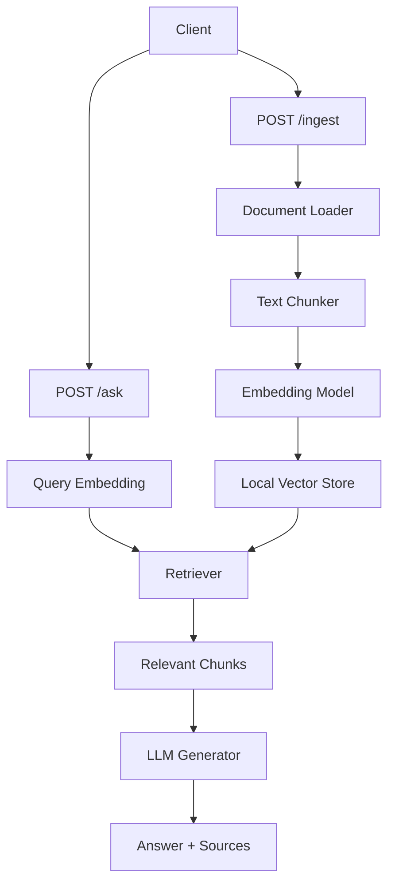

# Simple RAG API

A simple Retrieval-Augmented Generation (RAG) API built for an assignment. The service accepts PDF or TXT documents, indexes their content, and answers user questions with source references.

## Assignment Coverage

This project was built to satisfy the AI Engineer assignment requirements:

- Build a simple RAG pipeline for `PDF` and `TXT` documents
- Expose at least one endpoint that accepts a query
- Return an answer together with supporting source chunks
- Provide setup and usage instructions in the repository

## Quick Start

1. Create a virtual environment
2. Install dependencies
3. Copy `.env.example` to `.env`
4. Set `GEMINI_API_KEY`
5. Run `uvicorn app.main:app --reload`
6. Open `http://localhost:8000/docs`

## Overview

This project implements a minimal RAG pipeline with three main steps:

1. Ingest a document
2. Convert the document into searchable vector embeddings
3. Answer questions using only retrieved document context

## Features

- Upload PDF or TXT documents
- Extract and chunk text
- Generate embeddings and store vectors locally
- Retrieve relevant chunks for a user query
- Generate grounded answers with source references

## Tech Stack

- Python
- FastAPI
- Gemini API
- NumPy
- PyMuPDF

## Architecture



## Project Structure

```text
rag-assignment/
  app/
    api/
    rag/
    services/
    storage/
    config.py
    main.py
    schemas.py
  data/
    uploads/
    index/
  .env.example
  .gitignore
  README.md
  requirements.txt
```

## Setup

1. Create and activate a virtual environment
2. Install dependencies
3. Copy `.env.example` to `.env`
4. Add your Gemini API key

Recommended Python version: `3.11+`

### Windows PowerShell

```powershell
python -m venv .venv
.\.venv\Scripts\Activate.ps1
pip install -r requirements.txt
Copy-Item .env.example .env
```

### macOS / Linux

```bash
python -m venv .venv
source .venv/bin/activate
pip install -r requirements.txt
cp .env.example .env
```

## Environment Variables

```env
GEMINI_API_KEY=your_api_key_here
EMBEDDING_MODEL=gemini-embedding-001
CHAT_MODEL=gemini-2.5-flash
CHUNK_SIZE=800
CHUNK_OVERLAP=150
TOP_K=4
```

## Run Locally

```bash
uvicorn app.main:app --reload
```

The API will be available at `http://localhost:8000`.

Interactive API docs:

- `http://localhost:8000/docs`
- `http://localhost:8000/redoc`

## Demo Flow

1. Upload a document with `POST /ingest`
2. Ask a question with `POST /ask`
3. Review the generated answer and returned source chunks

## API Endpoints

### `GET /health`

Returns the service status.

Response:

```json
{
  "status": "ok"
}
```

### `POST /ingest`

Uploads a PDF or TXT document and indexes it for retrieval.

Request:
- `multipart/form-data`
- field name: `file`

Response:

```json
{
  "status": "success",
  "file_name": "sample.pdf",
  "chunks_indexed": 12
}
```

Notes:

- Supported file types: `pdf`, `txt`
- The uploaded file is stored locally in `data/uploads/`
- Vector data and metadata are stored in `data/index/`

### `POST /ask`

Accepts a user query and returns an answer based on indexed document content.

Request:

```json
{
  "query": "What is this document about?"
}
```

Response:

```json
{
  "answer": "The document explains ...",
  "sources": [
    {
      "file_name": "sample.pdf",
      "page": 1,
      "text": "Relevant content from the document...",
      "score": 0.1234
    }
  ]
}
```

Behavior:

- If no document has been indexed yet, the API returns an error
- If no relevant context is found, the API returns an answer indicating that the information was not found in the document

## Example Usage

Ingest a document:

```bash
curl -X POST "http://localhost:8000/ingest" \
  -F "file=@sample.pdf"
```

Ask a question:

```bash
curl -X POST "http://localhost:8000/ask" \
  -H "Content-Type: application/json" \
  -d "{\"query\":\"Summarize this document\"}"
```

## Running Tests

```bash
python -m pytest
```

Current automated coverage includes:

- health check
- validation for unsupported uploads
- validation when no documents are indexed
- a mocked end-to-end ingest + ask flow

## Limitations

- Local single-instance storage only
- Basic character-based chunking
- No authentication
- No document deletion or re-index workflow yet

## Future Improvements

- Add support for multiple document collections
- Improve chunking with token-aware splitting
- Add tests and CI
- Add Docker support
